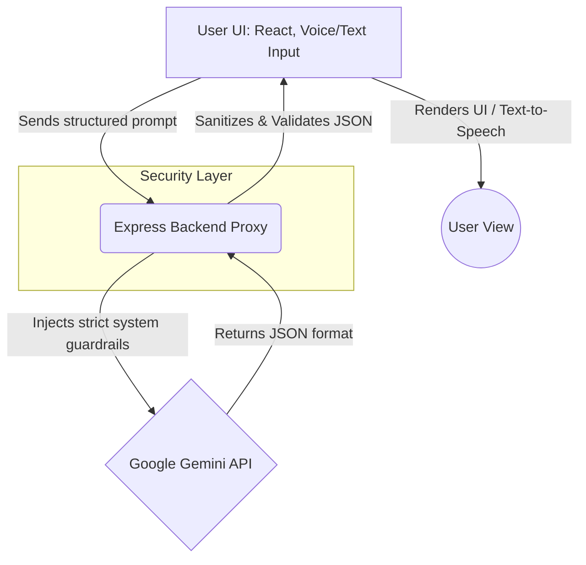

# VotePath AI 🗳️

**An AI-powered assistant simplifying elections and voting processes.**

[](https://votepath-ai-505150354601.us-central1.run.app/)

---

## 1. The Problem
Many citizens, especially first-time voters or those in rural areas, find the election process confusing. The lack of easily accessible, multi-lingual, and simplified information about voting eligibility, required documents, and polling locations often leads to lower voter turnout.

**Why existing solutions fail:**
- **Static Text Walls:** Government websites often present dense PDFs or legal jargon that is hard to digest.
- **Language Barriers:** Most portals are English-first, alienating regional language speakers.
- **Lack of Interactivity:** Voters can't ask specific questions (e.g., "I lost my ID, what else works?") and get immediate, context-aware answers.

## 2. Solution
**VotePath AI** is an intelligent, voice-enabled assistant designed to demystify the election process. It provides real-time, structured, and easy-to-understand answers to voting queries, ensuring that every citizen has the confidence and knowledge to cast their ballot.

## 3. Features
- **🤖 Smart AI Chat:** Powered by Gemini AI with strict guardrails to stay on election topics.
- **🌐 Multilingual Support:** Real-time translation and voice input/output in English, Hindi, Marathi, and Tamil.
- **🎙️ Voice & Text-to-Speech:** Accessible voice interactions using the Web Speech API.
- **🧠 Adaptive Tone:** Users can switch between "Standard", "Simplified (ELI5)", and "Deep Dive" explanations.
- **✅ Actionable Output:** Returns structured JSON containing steps, tips, and source references rather than just plain text walls.
- **♿ Accessibility Built-in:** Keyboard navigation, screen-reader friendly aria-labels, and high contrast UI.

## 4. Tech Stack
- **Frontend:** React, Vite, Tailwind CSS, Framer Motion, Lucide Icons
- **Backend:** Node.js, Express
- **AI Model:** Google Gemini API (via `@google/genai`)
- **Deployment:** Docker, Google Cloud Run

## 5. Architecture & Flow Diagram



1. **Frontend (React):** Manages UI state, captures voice/text input, and displays structured JSON responses from the backend.
2. **Backend (Express):** Acts as a secure proxy. Constructs strict system prompts, sends them to the Gemini API, and enforces JSON schema outputs.
3. **Gemini API:** Processes the prompt, determines relevance using context guardrails, and returns structured data (Title, Steps, Tips, Simple Explanation).

## 6. How It Works
1. User asks a question (e.g., "What documents do I need to vote?") via text or voice.
2. The React frontend sends the query and user preferences (language, tone) to the Express backend.
3. The backend appends strict system instructions and queries the **Google Gemini API**.
4. The backend validates the structured JSON response and sends it back to the client.
5. The frontend renders the response into an interactive, readable UI card with optional text-to-speech playback.

## 7. Environment Variables
To run this project locally, create a `.env` file in the root directory:

```env
GEMINI_API_KEY=your_google_gemini_api_key_here
```

> **Note:** API keys are stored exclusively on the backend via `process.env.GEMINI_API_KEY`. They are never exposed to the frontend bundle and are not committed to version control.

## 8. Google Services Integration
| Service | Usage |
|---------|-------|
| **Gemini API** | Core AI engine — processes election queries with strict JSON schema enforcement and context guardrails |
| **Google Cloud Run** | Production deployment — containerized via Docker for auto-scaling and zero-downtime |
| **Web Speech API** | Browser-native voice input (SpeechRecognition) and text-to-speech output across 4 languages |

## ⚡ 9. Performance Optimizations
- **Code splitting** using `React.lazy()` for route-level chunking
- **Memoization** using `React.memo` and `useCallback` to prevent unnecessary re-renders
- **Backend proxy** reduces API surface exposure and handles JSON parsing server-side
- **Framer Motion** `AnimatePresence` for GPU-accelerated animations

## 🧪 10. Testing Approach
- **Functional testing** — chatbot responses validated against expected JSON schema
- **Edge case testing** — off-topic queries return guardrail responses; API failure triggers graceful fallback
- **Rate limit testing** — rapid requests return `429` with user-friendly message
- **Accessibility testing** — keyboard navigation and screen reader compatibility verified

Full test case documentation: [`docs/testing.md`](docs/testing.md)

## 🔐 11. Security Measures
- API key stored **exclusively in backend** environment variables (never in frontend)
- **Input sanitization** — prompt type validation and 500-character length limit
- **Rate limiting** — IP-based throttle (2s cooldown) to prevent abuse
- **Context guardrails** — AI system prompt strictly blocks non-election queries

## ♿ 12. Accessibility
- `aria-label` on all interactive elements (buttons, inputs, selects)
- `aria-hidden` on decorative icons to prevent screen reader noise
- Focus ring states on all form elements
- Keyboard-navigable interface (Tab / Enter)
- High contrast text and UI components

